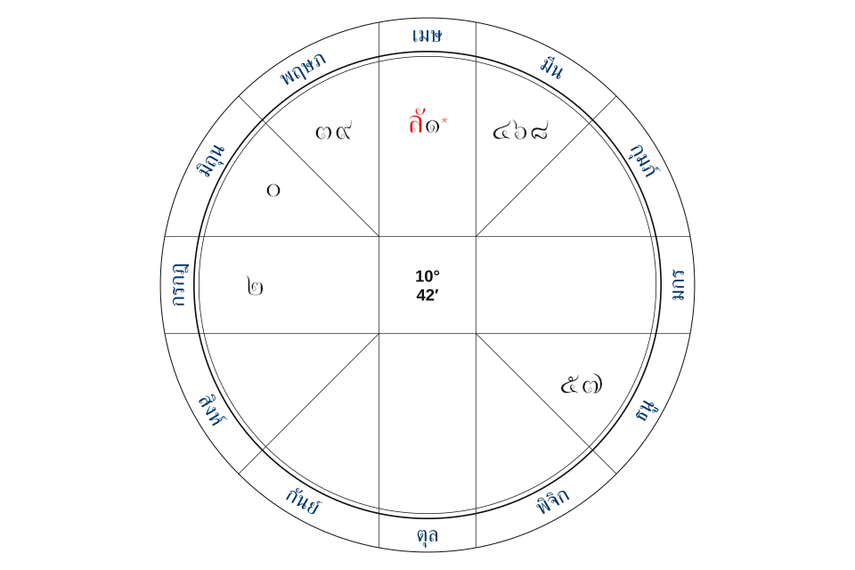

<h1 align="center">Thai Astrology - JavaScript &amp; TypeScript Library</h1>

<p align="center">
  Calculate Thai natal charts, ascendants and planetary transits with Suriyayatra
</p>

<p align="center">
  <a href="https://www.npmjs.com/package/thai-astrology"></a>
  <a href="https://github.com/kongesque/thai-astrology"></a>
  <a href="https://github.com/kongesque/thai-astrology/actions/workflows/ci.yml"></a>
  <a href="LICENSE"></a>
</p>

<p align="center">
  <a href="README.md">ภาษาไทย</a> &nbsp;|&nbsp;
  <a href="#calculate-a-thai-natal-chart-and-ascendant">Quick start</a> &nbsp;|&nbsp;
  <a href="#thai-astrology-api-reference">API</a> &nbsp;|&nbsp;
  <a href="https://github.com/kongesque/thai-astrology/issues">Report an issue</a>
</p>

`thai-astrology` is an **open source Thai astrology calculation library for JavaScript and TypeScript**. It uses classical Suriyayatra (สุริยยาตร์) to calculate natal birth charts, ascendants, planetary positions, transits, Taksa and Thai lunar calendar dates. Supply a civil date, local time and Thai province to get structured horoscope data through its API. Use and modify the code under the [MIT License](LICENSE).

Build Thai horoscope websites, astrology apps or APIs with deterministic, JSON-serializable results and your own interpretation rules. Other uses include ascendant calculators, natal and transit comparison tools, Thai lunar calendars, and educational tools for exploring Suriyayatra calculations.

Supports **Node.js 16+**, ESM and CommonJS, includes TypeScript types, works in browsers through a bundler, and has no runtime dependencies.

<p align="center">
  
</p>

<p align="center">
  <sub><a href="https://github.com/kongesque/thai-astrology/blob/main/scripts/render-readme-chart.cjs">Example Suriyayatra Rasi chart</a> · 21 April 1782 (BE 2325), 06:54, Bangkok</sub><br />
  <sub>Thai numerals identify planets; <code>ลั</code> marks the ascendant and <code>*</code> marks Tanuseth.</sub>
</p>

## What it calculates

- **Natal horoscopes:** 10 planetary positions, ascendants, houses, rulers, Tanuseth, lunar mansions, nine Rerk categories and dignities.
- **Chart data:** Rasi, navamsa and drekkana positions with Thai or Arabic numeral channels.
- **Transits and calendars:** Natal comparisons, Taksa, geometric lunar phase and Thai lunar dates.

## Calculate a Thai natal chart and ascendant

```bash
npm install thai-astrology
```

This example calculates the horoscope shown in the chart above:

```ts
import { calculateThaiHoroscope } from "thai-astrology"

const horoscope = calculateThaiHoroscope({
  date: { year: 2325, era: "BE", month: 4, day: 21 },
  time: { hour: 6, minute: 54 },
  location: { province: "กรุงเทพมหานคร" },
})

console.log(horoscope.points.sun.degrees, horoscope.points.sun.minutes) // 10 42
console.log(horoscope.points.ascendant.signName) // เมษ
console.log(horoscope.charts.rasi.channels.thai[0]) // ลั๑*
```

For CommonJS, replace the `import` line with `const { calculateThaiHoroscope } = require("thai-astrology")`.

The 1782 CE example is outside the 1900-2100 sample-comparison interval and does not establish historical accuracy.

### Birth date, local time and province

| Field | What to provide |
| --- | --- |
| `date` | A civil Gregorian date; use `era: "BE"` for Buddhist Era or `"CE"` for Common Era. BE 2567 = CE 2024 |
| `time` | Local civil time: hours 0-23, minutes 0-59. Birth time is required |
| `location` (optional) | A Thai `province` name; `getThaiAstrologyProvinces()` lists all 77 provinces |

Supply valid dates and times as numbers. Omitting the location applies zero correction. Set `location.localTimeCorrectionMinutes` to override the province correction in minutes. Names and gender are not required for calculation.

### Planetary positions, ascendants and horoscope results

| Result section | Available data |
| --- | --- |
| `points` | Planetary and ascendant positions, lunar mansion/Rerk data and planetary dignities; for example, `points.moon` |
| `houses` | All 12 houses, their rulers and occupants |
| `factors` | Ascendant ruler (`ascendantRuler`), Tanuseth and ascendant occupants (`ascendantOccupants`) |
| `charts` | Positions and channels for Rasi (ราศีจักร), navamsa (นวางค์จักร) and drekkana (ตรียางค์จักร) charts |
| `calendar` | Astrological weekday, geometric lunar phase and Thai lunar calendar date |
| `taksa` | บริวาร, อายุ, เดช, ศรี, มูละ, อุตสาหะ, มนตรี and กาลกิณี |
| `relationships` | Sign-based conjunctions, oppositions, trines, quadrangular groups (จตุโกณ) and sextiles |

Zodiac indices start at Aries = 0; house numbers start at ตนุ = 1. Chart channels run from Aries to Pisces, while `houses` start from the ascendant. Absolute longitudes are available in degrees (`longitudeDegrees`) and arcminutes (`longitudeArcMinutes`).

In `relationships`, `squares` contains planets in the 4th, 7th and 10th signs, counting the reference sign as 1. This quadrangular group includes the opposition.

## Compare planetary transits with a natal chart

Supply natal and transit dates and times using the same input shape:

```ts
import { calculateHoroscopeTransits } from "thai-astrology"

const result = calculateHoroscopeTransits({
  date: { year: 2325, era: "BE", month: 4, day: 21 },
  time: { hour: 6, minute: 54 },
  location: { province: "กรุงเทพมหานคร" },
}, {
  date: { year: 2567, era: "BE", month: 9, day: 15 },
  time: { hour: 8, minute: 30 },
  location: { province: "เชียงใหม่" },
})

console.log(result.transit.points.sun.signName)
console.log(result.comparison.sun.longitudeDifferenceDegrees)
```

The result contains `natal`, `transit` and `comparison`. Both dates and times are explicit; the API does not automatically use the current time.

## Thai astrology API reference

| API | Use it for |
| --- | --- |
| `calculateThaiHoroscope(input)` | A complete structured natal horoscope |
| `calculateHoroscopeTransits(natalInput, transitInput)` | Natal/transit horoscopes and comparisons |
| `validateHoroscopeInput(input)` | Validating form or API input; returns `valid` and `issues` for invalid input |
| `getThaiAstrologyProvinces()` | Province selectors with local-time corrections |
| `calculateDetailedPositions(input)` | Detailed Suriyayatra results using `CalculationInput` |
| `generateThaiAstrologyChart(input)` | The earlier chart API, which defaults to `legacy` |

`validateHoroscopeInput` reports invalid input without throwing. `calculateThaiHoroscope` and `calculateHoroscopeTransits` throw `HoroscopeInputError` with `issues`. See [HoroscopeInput / ThaiHoroscope](src/horoscope.ts) and [CalculationInput](src/engine/astro-calculation.ts) for full types.

**Calculation method:** `calculateThaiHoroscope` and `calculateDetailedPositions` always use Suriyayatra. For `generateThaiAstrologyChart`, select `method: "suriyayatra"` to use the same method. In the earlier input shape, `yearBe` means Buddhist Era and `yearBc` means **Common Era**. Supply one year field.

## Calculation rules and limitations

- **Classical Suriyayatra rules.** Results can differ from modern astronomical ephemerides or other astrological traditions. The library supplies interpretation data rather than finished predictions.
- **Local civil time.** There is no automatic timezone or DST conversion. Province corrections shift the 06:00 reference; they are not UTC offsets. The ascendant uses fixed rising durations and holds the Sun at its birth-time position, without coordinate-based sunrise or latitude/longitude calculations.
- **Bounded coverage and precision.** Civil dates accept CE 1-9999. Thai lunar dates support BE 2125-2619; outside that range, `calendar.thaiLunarDate` is `null`. Planetary positions use integer arcminutes; ascendant minutes may be fractional. Houses use the whole-sign system.
- **Calendar conventions.** Taksa changes day at 06:00 without substituting Rahu for Wednesday-night Mercury. Thai lunar dates change at midnight and are separate from geometric lunar phase. Thai Ketu follows its own 679-day cycle.
- **Position comparisons.** Relationships are sign-based. Degree aspects with orbs, instantaneous speeds, retrograde status and ingress searches are not implemented. Longitude differences are not instantaneous speeds, and sign-start schedules are not precise future ingress times.

## Development and contributions

Use Node.js 24 for development and check changes before submitting:

```bash
git clone https://github.com/kongesque/thai-astrology.git
cd thai-astrology
npm ci
npm run check
```

`npm run check` validates TypeScript, runs behavior tests and verifies installed-package consumers. Optional local comparisons run when supplementary resources are available; otherwise, that step is skipped. CI tests Node.js 16, 22 and 24. Edit code in `src/`; regenerate the chart illustration with `npm run docs:chart`.

Report bugs or suggest improvements through [GitHub Issues](https://github.com/kongesque/thai-astrology/issues). For calculation differences, include the date, local time, province, method and expected result, without names or personal details.

Released under the [MIT License](LICENSE).
